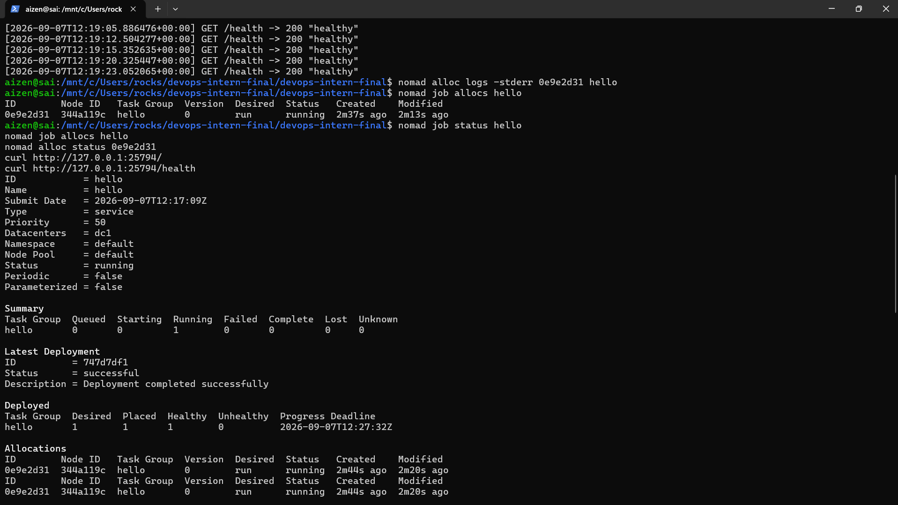

# DevOps Intern Final Assessment

**Author:** Sai Krishna Reddy  
**Repository:** [https://github.com/mukkarasaikrishnareddy/devops-intern-final](https://github.com/mukkarasaikrishnareddy/devops-intern-final)

---

## 1. Project Overview

This repository implements a complete DevOps automation pipeline for a long-running Python HTTP application. It demonstrates modern DevOps practices including containerisation, CI/CD automation with GitHub Container Registry (GHCR), workload scheduling with Nomad, structured log ingestion and querying with Grafana Loki, and system diagnostic scripting in Linux.

---

## 2. CI/CD & Deployment Pipeline

```text
Developer pushes code
        ↓
GitHub Actions runs Python tests
        ↓
Docker image is built
        ↓
Docker image is pushed to GHCR
        ↓
Nomad pulls and runs the image
        ↓
Application exposes port 8080
        ↓
Application generates logs
        ↓
Logs are sent to Loki
        ↓
Logs are queried from Loki
```

---

## 3. Technologies Used

| Technology | Version | Purpose |
|------------|---------|---------|
| **Python** | 3.14.4 (Windows) / 3.12.3 (WSL) | Standard-library HTTP web service |
| **Git** | 2.53.0.windows.1 | Source control and version tracking |
| **Docker Desktop** | 27.5.1 | Container build and local runtime |
| **Docker Compose** | v2.32.4-desktop.1 | Multi-container management |
| **GitHub Actions** | v4 / v5 actions | CI/CD automation and GHCR publishing |
| **GHCR** | — | Container image registry |
| **HashiCorp Nomad** | 2.0.5 | Container workload orchestration |
| **Grafana Loki** | 3.7.7 | Structured log aggregation and querying |
| **Linux / WSL2** | Ubuntu (WSL2) | System information scripting environment |

---

## 4. Repository Structure

```text
devops-intern-final/
├── .github/
│   └── workflows/
│       └── ci.yml                  # GitHub Actions workflow
├── monitoring/
│   ├── loki_setup.txt              # Loki setup and API instructions
│   └── send_logs.py                # Script for pushing and querying Loki logs
├── nomad/
│   └── hello.nomad                 # Nomad job specification
├── screenshots/
│   ├── docker-build-run.png        # Docker build and execution screenshot
│   ├── github-actions-success.png  # GitHub Actions workflow screenshot
│   ├── linux-sysinfo.png           # Linux sysinfo script screenshot
│   └── nomad-job-deployment.png    # Verified Nomad deployment screenshot
├── scripts/
│   └── sysinfo.sh                  # Linux system information script
├── Dockerfile                       # Container definition
├── hello.py                         # Long-running HTTP service
└── README.md                        # Project documentation
```

---

## 5. Application Behavior (`hello.py`)

The application is a long-running HTTP service built exclusively using Python's standard-library `http.server` module.

- **Host:** `0.0.0.0`
- **Port:** `8080`
- **Configurable port:** The port can be overridden using the `PORT` environment variable.

### Endpoints

| Method | Endpoint | Response |
|--------|----------|----------|
| `GET` | `/` | `200 OK` with `Hello, DevOps!` |
| `GET` | `/health` | `200 OK` with `healthy` |
| `GET` | Any other path | `404 Not Found` with `Not Found` |

### Local Execution & Testing

Start the application:

```bash
python hello.py
```

Test the HTTP responses:

```bash
curl http://localhost:8080
curl http://localhost:8080/health
curl -v http://localhost:8080/unknown
```

---

## 6. Docker Containerisation (`Dockerfile`)

### Dockerfile Specification

```dockerfile
FROM python:3.12-slim

WORKDIR /app

COPY hello.py .

EXPOSE 8080

CMD ["python", "hello.py"]
```

### Build & Smoke Test

Build the Docker image:

```bash
docker build -t devops-hello:latest .
```

Run the container:

```bash
docker run -d \
  --name devops-hello-container \
  -p 18080:8080 \
  devops-hello:latest
```

Verify the endpoints:

```bash
curl http://localhost:18080
curl http://localhost:18080/health
```

Inspect the container logs:

```bash
docker logs devops-hello-container
```

Remove the container:

```bash
docker rm -f devops-hello-container
```

---

## 7. GitHub Actions CI/CD (`.github/workflows/ci.yml`)

The workflow triggers on `push` and `pull_request` events targeting the `main` branch.

### Key Features

1. **Permissions**
   - `contents: read`
   - `packages: write`

2. **Test Job**
   - Sets up Python 3.12.
   - Compiles `hello.py` syntax.
   - Starts the application in the background.
   - Tests `/` and `/health`.
   - Uploads `server.log` as an artifact using `actions/upload-artifact@v4`.

3. **Build and Push Job**
   - Runs only after the test job succeeds.
   - Authenticates to GHCR using `${{ secrets.GITHUB_TOKEN }}`.
   - Builds the Docker image.
   - Performs a container smoke test.
   - Pushes the image to GHCR.
   - Verifies the image digest.

### Published Image

```text
ghcr.io/mukkarasaikrishnareddy/devops-hello:latest
```

---

## 8. GHCR Package Settings

The container image is published to:

```text
ghcr.io/mukkarasaikrishnareddy/devops-hello:latest
```

### Making the GHCR Package Public

1. Navigate to GitHub.
2. Open your profile or organization.
3. Select **Packages**.
4. Select the `devops-hello` package.
5. Open **Package settings**.
6. Select **Change package visibility**.
7. Set the package visibility to **Public** and confirm.

---

## 9. Nomad Orchestration (`nomad/hello.nomad`)

### Job Definition

```hcl
job "hello" {
  datacenters = ["dc1"]
  type        = "service"

  group "hello" {
    count = 1

    network {
      port "http" {
        to = 8080
      }
    }

    service {
      name     = "hello"
      port     = "http"
      provider = "nomad"
      tags     = ["devops", "http"]

      check {
        name     = "http-health"
        type     = "http"
        path     = "/health"
        interval = "10s"
        timeout  = "2s"
      }
    }

    task "hello" {
      driver = "docker"

      config {
        image = "ghcr.io/mukkarasaikrishnareddy/devops-hello:latest"
        ports = ["http"]
      }

      resources {
        cpu    = 100
        memory = 128
      }
    }
  }
}
```

### Execution Commands

Validate the Nomad job specification:

```bash
nomad job validate nomad/hello.nomad
```

Run the job:

```bash
nomad job run nomad/hello.nomad
```

Check the job status:

```bash
nomad job status hello
```

List the job allocations:

```bash
nomad job allocs hello
```

Check a specific allocation:

```bash
nomad alloc status <ALLOCATION_ID>
```

Check allocation logs:

```bash
nomad alloc logs <ALLOCATION_ID> hello
```

Test the application using the dynamically assigned host port:

```bash
curl http://127.0.0.1:<NOMAD_HOST_PORT>/
curl http://127.0.0.1:<NOMAD_HOST_PORT>/health
```

### Verified Nomad Deployment

The Nomad job was successfully deployed and verified using the Docker driver inside WSL2.

| Property | Verified Value |
|----------|----------------|
| **Job ID** | `hello` |
| **Allocation ID** | `0e9e2d31` |
| **Docker image** | `ghcr.io/mukkarasaikrishnareddy/devops-hello:latest` |
| **Task driver** | `docker` |
| **Port mapping** | `127.0.0.1:25794 -> 8080` |
| **Deployment status** | `successful` |
| **Deployment health** | `healthy` |
| **Service health check** | `success` |
| **Task status** | `running` |
| **Restarts** | `0` |

The Docker driver was detected as healthy on the WSL2 Nomad agent. The allocation successfully pulled the GHCR image, started the container, and passed the configured HTTP health check.

### Nomad Application Verification

Request to the root endpoint:

```bash
curl http://127.0.0.1:25794/
```

Output:

```text
Hello, DevOps!
```

Request to the health endpoint:

```bash
curl http://127.0.0.1:25794/health
```

Output:

```text
healthy
```

Nomad allocation logs also confirmed successful application startup and repeated successful health-check responses.

The final deployment was performed using Linux Docker inside WSL2 because the native Windows Nomad Docker driver was not compatible with the Linux container configuration.

---

## 10. Loki Log Aggregation (`monitoring/send_logs.py`)

### Setup & Ingestion Steps

Start the Grafana Loki container:

```bash
docker run -d \
  --name loki \
  -p 3100:3100 \
  grafana/loki:latest \
  "-config.file=/etc/loki/local-config.yaml"
```

Verify the readiness endpoint:

```bash
curl http://localhost:3100/ready
```

Push logs using the Python standard-library script:

```bash
python monitoring/send_logs.py
```

The script sends a JSON log payload to:

```text
http://localhost:3100/loki/api/v1/push
```

The log stream uses the label:

```text
job=devops-hello
```

A successful push returns HTTP status `204`.

Query Loki log entries:

```bash
curl "http://localhost:3100/loki/api/v1/query_range?query=%7Bjob%3D%22devops-hello%22%7D"
```

---

## 11. Linux System Information Script (`scripts/sysinfo.sh`)

The script outputs:

- User context
- Current UTC timestamp
- Disk filesystem usage

Execute the script in Linux or WSL2:

```bash
bash scripts/sysinfo.sh
```

---

## 12. Verification & Testing Summary

| Test Case | Command | Result / Status |
|-----------|---------|-----------------|
| Python `hello.py` GET `/` | `curl http://localhost:8081` | ✅ Passed — `Hello, DevOps!` |
| Python `hello.py` GET `/health` | `curl http://localhost:8081/health` | ✅ Passed — `healthy` |
| Python `hello.py` GET 404 path | `curl http://localhost:8081/unknown` | ✅ Passed — `404 Not Found` |
| Docker image build | `docker build -t devops-hello:latest .` | ✅ Passed |
| Docker container smoke test | `docker run -p 18080:8080 ...` | ✅ Passed |
| GitHub Actions workflow | GitHub Actions workflow run | ✅ Passed |
| GHCR image push | `ghcr.io/mukkarasaikrishnareddy/devops-hello:latest` | ✅ Passed |
| Nomad HCL syntax | `nomad job validate nomad/hello.nomad` | ✅ Passed |
| Nomad job submission | `nomad job run nomad/hello.nomad` | ✅ Passed |
| Nomad allocation | `nomad job allocs hello` | ✅ Passed — allocation running |
| Nomad deployment health | `nomad job status hello` | ✅ Passed — deployment successful and healthy |
| Nomad HTTP health check | `/health` | ✅ Passed — service check successful |
| Nomad application response | `curl http://127.0.0.1:25794/` | ✅ Passed — `Hello, DevOps!` |
| Nomad application health | `curl http://127.0.0.1:25794/health` | ✅ Passed — `healthy` |
| Loki readiness and log push | `python monitoring/send_logs.py` | ✅ Passed — HTTP 204 received |
| Loki query verification | `/loki/api/v1/query_range` | ✅ Passed — log line retrieved |
| Linux script execution | `wsl bash scripts/sysinfo.sh` | ✅ Passed |
| Line endings and secrets scan | `git diff --check`, `git grep` | ✅ Passed — LF line endings and no secrets detected |

---

## 13. Limitations & Environmental Notes

1. **Host Port 8080 Occupancy**

   Host port `8080` was occupied by an existing Jenkins service. Local standalone testing therefore used host port `8081`, while Docker testing used the mapping `18080:8080`.

   The internal application and container port remained `8080`.

2. **Nomad Execution Environment**

   The final Nomad deployment was executed inside WSL2 using a Linux Docker environment.

   The native Windows Nomad agent was not used for the final deployment because the Docker driver reported that Docker was configured for Linux containers while the Windows agent expected Windows containers.

3. **Dynamic Nomad Port**

   Nomad assigned the host port dynamically. The verified deployment used:

   ```text
   127.0.0.1:25794 -> 8080
   ```

   The internal application port remains `8080`.

4. **Dynamic Allocation ID**

   Allocation IDs and host ports may change when the Nomad job is restarted or redeployed. The values documented above correspond to the verified deployment run.

---

## 14. Evidence Screenshots




---

## 15. Repository Link

[https://github.com/mukkarasaikrishnareddy/devops-intern-final](https://github.com/mukkarasaikrishnareddy/devops-intern-final)
