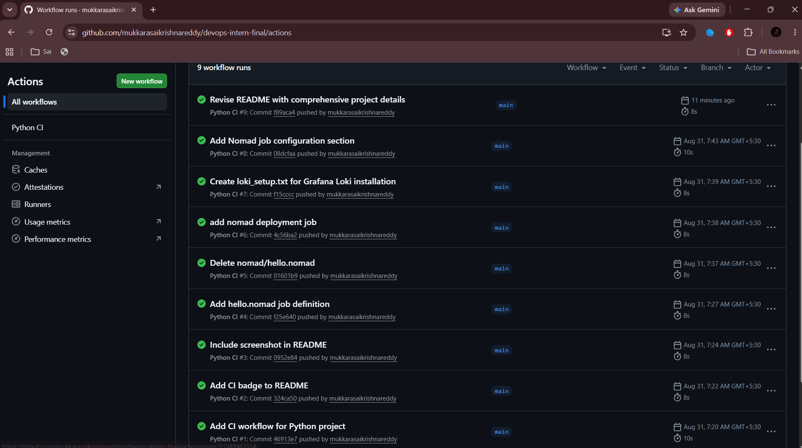
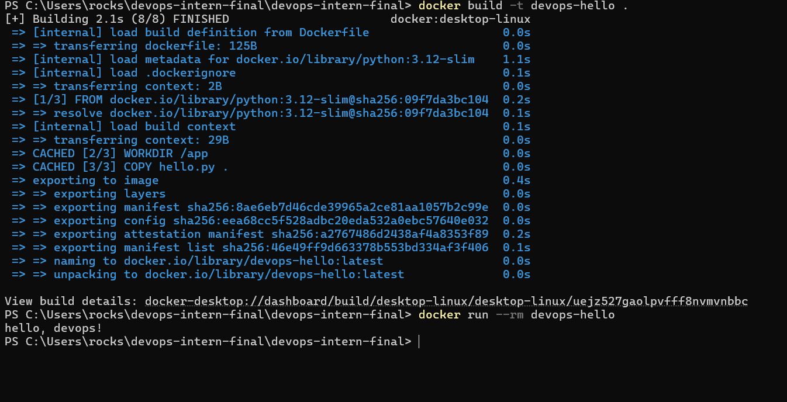
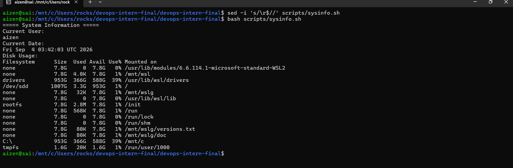

# DevOps Intern Final Assessment

**Name:** Sai Krishna Reddy  
**Assessment:** DevOps Intern Final Assessment  
**Date:** 21 August 2026  

[](https://github.com/mukkarasaikrishnareddy/devops-intern-final/actions/workflows/ci.yaml)

---

## 1. Project Overview

This project demonstrates a basic DevOps workflow for building, testing, containerizing, and managing a Python application using open-source tools.

The project includes:

- Git and GitHub version control
- Linux system information scripting
- Python application development
- Docker containerization
- GitHub Actions continuous integration
- HashiCorp Nomad job configuration
- Grafana Loki monitoring setup documentation

The Python application prints:

```text
Hello, DevOps!
```

---

## 2. Technologies Used

| Technology | Purpose |
|------------|---------|
| Python | Application development |
| Git | Version control |
| GitHub | Source-code hosting |
| Linux/Bash | System information script |
| Docker | Application containerization |
| GitHub Actions | Continuous Integration |
| HashiCorp Nomad | Workload scheduling |
| Grafana Loki | Centralized log aggregation |

---

## 3. Repository Structure

```text
devops-intern-final/
│
├── .github/
│   └── workflows/
│       └── ci.yaml
│
├── monitoring/
│   └── loki_setup.txt
│
├── nomad/
│   └── hello.nomad
│
├── scripts/
│   └── sysinfo.sh
│
├── screenshots/
│   ├── github-actions-success.png
│   ├── docker-build-run.png
│   └── linux-sysinfo.png
│
├── .gitignore
├── Dockerfile
├── README.md
└── hello.py
```

---

## 4. Python Application

The Python application is located in:

```text
hello.py
```

The application prints a simple message to verify that the Python environment is working correctly.

### Run the Application

```bash
python hello.py
```

### Expected Output

```text
Hello, DevOps!
```

---

## 5. Linux System Information Script

The Linux shell script is located at:

```text
scripts/sysinfo.sh
```

The script displays:

- Current username
- Current date and time
- Disk usage information

### Run the Script

```bash
bash scripts/sysinfo.sh
```

On Linux, the script can also be made executable:

```bash
chmod +x scripts/sysinfo.sh
```

Then execute it using:

```bash
./scripts/sysinfo.sh
```

### Example Output

```text
===== System Information =====

Current User:
username

Current Date:
Thu Aug 21 10:30:00 UTC 2026

Disk Usage:
Filesystem      Size  Used Avail Use% Mounted on
...
```

---

## 6. Docker Containerization

Docker is used to package the Python application and its runtime environment into a container image.

### Dockerfile

```dockerfile
FROM python:3.12-slim

WORKDIR /app

COPY hello.py .

CMD ["python", "hello.py"]
```

### Build the Docker Image

Run the following command from the repository root:

```bash
docker build -t devops-hello:latest .
```

### Run the Docker Container

```bash
docker run --rm devops-hello:latest
```

### Expected Output

```text
Hello, DevOps!
```

### Docker Workflow

```text
hello.py
   |
   v
Dockerfile
   |
   v
Docker Image
   |
   v
Docker Container
   |
   v
Hello, DevOps!
```

---

## 7. GitHub Actions Continuous Integration

The GitHub Actions workflow is located at:

```text
.github/workflows/ci.yaml
```

The workflow automatically runs whenever code is pushed to the repository or a pull request is created.

### CI Workflow Tasks

The workflow performs the following tasks:

1. Checks out the repository code.
2. Installs Python 3.12.
3. Executes the Python application.
4. Verifies that the application runs successfully.

### Workflow Configuration

```yaml
name: Python CI

on:
  push:
  pull_request:

jobs:
  test:
    runs-on: ubuntu-latest

    steps:
      - name: Checkout repository
        uses: actions/checkout@v4

      - name: Set up Python
        uses: actions/setup-python@v5
        with:
          python-version: "3.12"

      - name: Run hello.py
        run: python hello.py
```

### CI Pipeline

```text
Developer Push
      |
      v
GitHub Repository
      |
      v
GitHub Actions
      |
      v
Checkout Code
      |
      v
Install Python 3.12
      |
      v
Run hello.py
      |
      v
Successful CI Build
```

### GitHub Actions

The workflow execution can be viewed here:

[View GitHub Actions](https://github.com/mukkarasaikrishnareddy/devops-intern-final/actions)

---

## 8. HashiCorp Nomad

The Nomad job configuration is located at:

```text
nomad/hello.nomad
```

The job is configured to run the Docker image:

```text
devops-hello:latest
```

### Run the Nomad Job

After installing and starting Nomad, run:

```bash
nomad job run nomad/hello.nomad
```

### Check Job Status

```bash
nomad job status hello
```

### Inspect the Job

```bash
nomad job inspect hello
```

### Check Allocations

```bash
nomad alloc status
```

### Nomad Workflow

```text
Nomad Job File
      |
      v
Nomad Scheduler
      |
      v
Docker Driver
      |
      v
devops-hello Container
      |
      v
Hello, DevOps!
```

The Nomad configuration is provided in the repository for deployment in a Nomad environment.

---

## 9. Grafana Loki Monitoring

The Loki setup documentation is located at:

```text
monitoring/loki_setup.txt
```

Grafana Loki is a log aggregation system that can be used to collect, store, and query application and container logs.

### Start Loki Using Docker

```bash
docker run -d \
  --name loki \
  -p 3100:3100 \
  grafana/loki:latest \
  -config.file=/etc/loki/local-config.yaml
```

### Check Loki Health

```bash
curl http://localhost:3100/ready
```

### Expected Response

```text
ready
```

### View Loki Logs

```bash
docker logs loki
```

For a complete production monitoring setup, a log shipping agent such as Promtail or Grafana Alloy can forward container logs to Loki.

### Loki Endpoint

```text
http://localhost:3100
```

---

## 10. Testing and Verification

The following commands can be used to verify the project components.

### Test the Python Application

```bash
python hello.py
```

Expected output:

```text
Hello, DevOps!
```

### Test the Linux Script

```bash
bash scripts/sysinfo.sh
```

### Build the Docker Image

```bash
docker build -t devops-hello:latest .
```

### Run the Docker Container

```bash
docker run --rm devops-hello:latest
```

### Test the GitHub Actions Workflow

The GitHub Actions workflow runs automatically after pushing changes to the repository.

### Test the Nomad Configuration

```bash
nomad job run nomad/hello.nomad
```

### Test Loki

```bash
curl http://localhost:3100/ready
```

---

## 11. Screenshots

Screenshots are stored in the `screenshots/` directory.

### GitHub Actions Successful Run



### Docker Build and Run



### Linux System Information Script



---

## 12. Learning Outcomes

This assessment helped me gain practical experience with:

- Creating and managing a GitHub repository
- Using Git for version control
- Writing and executing Bash scripts
- Building Docker images
- Running Docker containers
- Automating tasks using GitHub Actions
- Writing a HashiCorp Nomad job specification
- Understanding centralized logging with Grafana Loki
- Organizing a DevOps project using a standard repository structure
- Documenting commands, configurations, and testing procedures

---

## 13. GitHub Repository
(https://github.com/mukkarasaikrishnareddy/devops-intern-final)

---

## 14. Releases

No releases have been published for this assessment.
